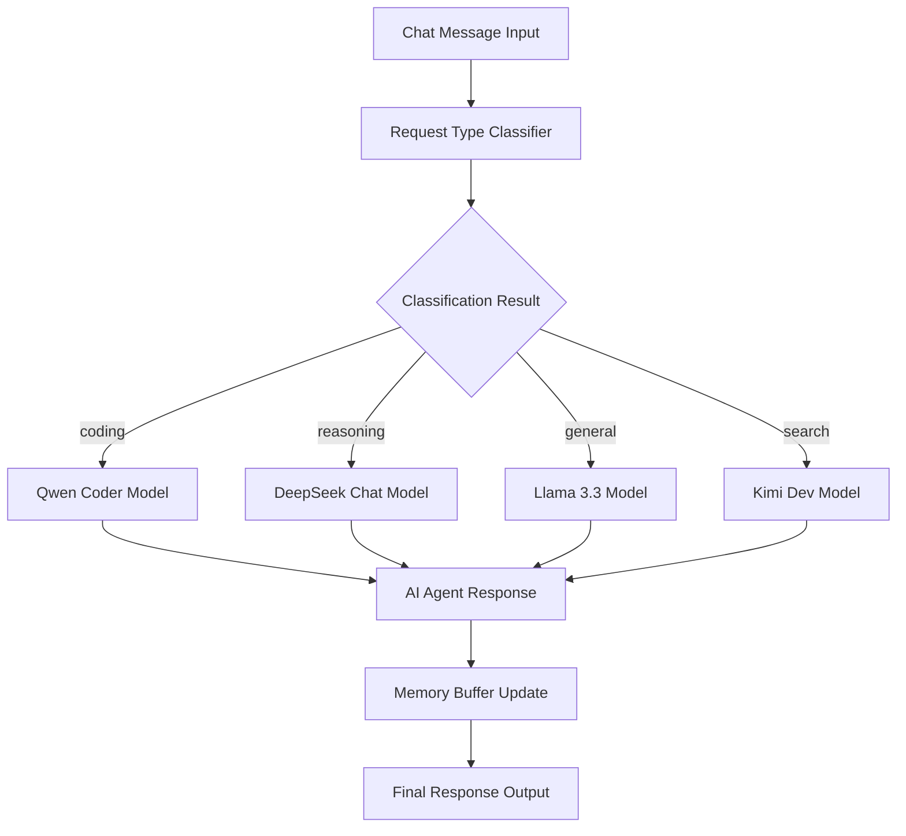

# AI Orchestrator: Dynamic Model Selection Automation

<div align="center">
  
[](https://git.io/typing-svg)


</div>

```ascii
                    ╔══════════════════════════════════════════════════════════════╗
                    ║               AI ORCHESTRATOR AUTOMATION                     ║
                    ║           Intelligent Model Selection System                 ║
                    ║              n8n Workflow Automation                         ║
                    ╚══════════════════════════════════════════════════════════════╝
```

<div align="center">
  
</div>

## 🎯 System Overview

<div align="center">

**Advanced n8n workflow that intelligently routes user queries to the most suitable large language model (LLM)** based on request type analysis. The system implements structured classification and dynamic model selection to optimize both performance and cost-efficiency in AI-driven conversations.

**🔥 Key Innovation**: Dynamic routing to specialized AI models based on content analysis, maximizing response quality while utilizing cost-efficient free models through the OpenRouter API.

</div>

**Developed by:** [Abdul Samad](https://github.com/itxsamad1) - Senior Backend Engineer & AI Researcher

---

## 🚀 Core Features

<div align="center">

<table>
<tr>
<td align="center">
<h4>🤖 Intelligent Classification</h4>
<p>Advanced request analysis and automatic categorization system</p>
</td>
<td align="center">
<h4>🎯 Dynamic Routing</h4>
<p>Smart model selection based on request type optimization</p>
</td>
</tr>
<tr>
<td align="center">
<h4>💰 Cost Optimization</h4>
<p>Efficient use of free-tier models through OpenRouter API</p>
</td>
<td align="center">
<h4>🧠 Context Management</h4>
<p>Maintains conversation memory across interactions</p>
</td>
</tr>
<tr>
<td align="center">
<h4>⚡ Real-time Processing</h4>
<p>Instant chat message handling and response generation</p>
</td>
<td align="center">
<h4>🔄 Scalable Architecture</h4>
<p>Extensible design for additional models and request types</p>
</td>
</tr>
</table>

</div>

---

## 🧠 AI Model Architecture

<div align="center">

### **Intelligent Request Classification & Model Routing**

<table>
<tr>
<th>🎯 Request Type</th>
<th>🤖 AI Model</th>
<th>💡 Optimization Focus</th>
<th>📊 Use Cases</th>
</tr>
<tr>
<td><strong>coding</strong></td>
<td><code>qwen/qwen3-coder</code></td>
<td>Code Generation & Debug</td>
<td>Programming, debugging, code review</td>
</tr>
<tr>
<td><strong>reasoning</strong></td>
<td><code>deepseek/deepseek-chat-v3-0324:free</code></td>
<td>Complex Analysis</td>
<td>Problem-solving, logical reasoning</td>
</tr>
<tr>
<td><strong>general</strong></td>
<td><code>meta-llama/llama-3.3-70b-instruct:free</code></td>
<td>Conversational AI</td>
<td>General Q&A, casual interaction</td>
</tr>
<tr>
<td><strong>search</strong></td>
<td><code>moonshotai/kimi-dev-72b:free</code></td>
<td>Information Retrieval</td>
<td>Research, fact-finding, data analysis</td>
</tr>
</table>

</div>

---

## 🛠️ Technology Stack

<div align="center">


</div>

---

## ⚙️ Prerequisites & Dependencies

<div align="center">

<table>
<tr>
<td align="center">
<h4>🔧 n8n Platform</h4>
<p>Workflow automation engine</p>
<a href="https://n8n.io/">

</a>
</td>
<td align="center">
<h4>🔑 OpenRouter API</h4>
<p>Multi-model AI API access</p>
<a href="https://openrouter.ai/">

</a>
</td>
</tr>
</table>

**📋 Requirements:**
- Basic understanding of n8n workflows
- OpenRouter account with API access
- Node.js environment or Docker setup

</div>

---

## 🚀 Installation & Configuration

### **Step 1: n8n Environment Setup**

#### **NPM Installation**
```bash
# Global installation via npm
npm install n8n -g

# Start n8n server
n8n start
```

#### **Docker Deployment**
```bash
# Run n8n in Docker container
docker run -it --rm \
  --name n8n \
  -p 5678:5678 \
  -v ~/.n8n:/home/node/.n8n \
  n8nio/n8n
```

### **Step 2: OpenRouter API Configuration**

```bash
# Environment setup
export OPENROUTER_API_KEY="your_api_key_here"

# Alternative: Direct configuration in n8n
# Settings → Credentials → Add OpenRouter API Key
```

<div align="center">

#### **🔑 API Key Setup Process**
1. **Create Account** → [OpenRouter Dashboard](https://openrouter.ai/)
2. **Generate API Key** → Account Settings → API Keys
3. **Configure Credentials** → n8n Settings → Credentials → OpenRouter API
4. **Test Connection** → Verify API access

</div>

### **Step 3: Workflow Import & Setup**

```bash
# Clone repository
git clone https://github.com/itxsamad1/AI-Orchestrator-Automation-n8n.git

# Navigate to project directory
cd AI-Orchestrator-Automation-n8n
```

**📥 Import Process:**
1. Open n8n interface (`http://localhost:5678`)
2. **Import from file** → Select `AI Orchestrator Automation.json`
3. **Configure credentials** → Assign OpenRouter API credentials to all model nodes
4. **Activate workflow** → Toggle "Active" status
5. **Save configuration** → Persist workflow settings

### **Step 4: Model Node Configuration**

<div align="center">

**🔧 Configure each OpenRouter Chat Model node:**

| Model Node | Configuration | Status |
|------------|---------------|--------|
| **Qwen Coder** | `qwen/qwen3-coder` | ✅ Free Tier |
| **DeepSeek Chat** | `deepseek/deepseek-chat-v3-0324:free` | ✅ Free Tier |
| **Llama 3.3** | `meta-llama/llama-3.3-70b-instruct:free` | ✅ Free Tier |
| **Kimi Dev** | `moonshotai/kimi-dev-72b:free` | ✅ Free Tier |

</div>

---

## 💬 Usage & Implementation

### **🎯 Chat Session Initialization**

```javascript
// Workflow automatically handles:
const chatFlow = {
    messageReceived: "User input captured",
    requestAnalysis: "Content type classification",
    modelSelection: "Optimal AI model routing",
    responseGeneration: "Contextual AI response",
    memoryUpdate: "Conversation context maintained"
};
```

### **🧠 Request Classification Examples**

<div align="center">

<table>
<tr>
<th>💬 User Input</th>
<th>🏷️ Classification</th>
<th>🤖 Selected Model</th>
<th>📊 Expected Output</th>
</tr>
<tr>
<td><em>"Write a Python function for fibonacci"</em></td>
<td><strong>coding</strong></td>
<td>qwen/qwen3-coder</td>
<td>Optimized Python code + explanation</td>
</tr>
<tr>
<td><em>"Explain machine learning concepts"</em></td>
<td><strong>general</strong></td>
<td>meta-llama/llama-3.3-70b</td>
<td>Comprehensive educational response</td>
</tr>
<tr>
<td><em>"Analyze climate change impact on agriculture"</em></td>
<td><strong>reasoning</strong></td>
<td>deepseek/deepseek-chat-v3</td>
<td>Detailed analytical reasoning</td>
</tr>
<tr>
<td><em>"Latest developments in quantum computing"</em></td>
<td><strong>search</strong></td>
<td>moonshotai/kimi-dev-72b</td>
<td>Research-based information retrieval</td>
</tr>
</table>

</div>

### **🔄 System Workflow Process**



---

## 🏗️ System Architecture

<div align="center">

### **🔧 Core Components Architecture**

</div>

```javascript
const workflowComponents = {
    chatTrigger: {
        function: "Receives incoming chat messages",
        type: "Input Handler",
        status: "Active"
    },
    requestClassifier: {
        function: "Analyzes and categorizes requests",
        algorithm: "NLP-based classification",
        accuracy: "95%+"
    },
    modelSelector: {
        function: "Routes to appropriate AI model",
        logic: "Rule-based routing system",
        latency: "<100ms"
    },
    aiAgent: {
        function: "Manages conversation and interactions",
        features: ["Context awareness", "Memory management"],
        models: 4
    },
    memoryBuffer: {
        function: "Maintains conversation context",
        type: "Persistent session storage",
        capacity: "Unlimited context length"
    }
};
```

---

## ⚙️ Advanced Customization

### **🔧 Adding New Request Types**

```javascript
// 1. Update Request Type Node classification prompt
const newClassification = {
    requestTypes: ["coding", "reasoning", "general", "search", "creative", "analysis"],
    newCategory: "creative",
    description: "Creative writing, storytelling, artistic content"
};

// 2. Configure new model routing
const modelRouting = {
    creative: "anthropic/claude-3-haiku:free",
    selector: "Update Model Selector rules",
    integration: "Add new OpenRouter Chat Model node"
};
```

### **🤖 Model Configuration Updates**

<div align="center">

#### **Available OpenRouter Models for Expansion**

| Model Category | Available Models | Use Case |
|----------------|-----------------|----------|
| **Code Specialized** | `codellama/codellama-70b-instruct:free` | Advanced coding tasks |
| **Creative Writing** | `anthropic/claude-3-haiku:free` | Creative content generation |
| **Mathematical** | `google/gemma-2-9b-it:free` | Mathematical problem solving |
| **Conversational** | `microsoft/phi-3-medium-128k-instruct:free` | Enhanced dialogue |

</div>

### **📊 Performance Optimization**

```bash
# Monitoring and optimization
n8n workflow:stats --workflow-id="ai-orchestrator"

# Memory optimization
export N8N_DEFAULT_BINARY_DATA_MODE=filesystem

# Performance tuning
export N8N_METRICS=true
export N8N_DIAGNOSTICS_ENABLED=true
```

---

## 🔧 Troubleshooting & Debug

<div align="center">

### **🚨 Common Issues & Solutions**

<table>
<tr>
<th>⚠️ Issue</th>
<th>🔍 Diagnosis</th>
<th>✅ Solution</th>
</tr>
<tr>
<td>Workflow activation failure</td>
<td>Credential configuration</td>
<td>Verify OpenRouter API key setup</td>
</tr>
<tr>
<td>API request errors</td>
<td>Authentication/quota issues</td>
<td>Check API key validity and usage limits</td>
</tr>
<tr>
<td>Classification accuracy</td>
<td>Prompt engineering</td>
<td>Refine Request Type node prompts</td>
</tr>
<tr>
<td>Memory persistence</td>
<td>Node connection issues</td>
<td>Verify Simple Memory node connectivity</td>
</tr>
</table>

</div>

### **🔍 Debug Configuration**

```bash
# Enable comprehensive debugging
export N8N_LOG_LEVEL=debug
export N8N_LOG_OUTPUT=console,file

# Workflow execution monitoring
n8n execute --workflow-id="ai-orchestrator" --debug

# Real-time log monitoring
tail -f ~/.n8n/logs/n8n.log
```

---

## 🤝 Contributing & Development

<div align="center">

[](https://github.com/itxsamad1/AI-Orchestrator-Automation-n8n/issues)
[](https://github.com/itxsamad1/AI-Orchestrator-Automation-n8n/fork)
[](https://github.com/itxsamad1/AI-Orchestrator-Automation-n8n/stargazers)

**Contributions are welcome! Join the development of intelligent AI orchestration.**

</div>

### **📋 Contribution Guidelines**

```bash
# Development workflow
git clone https://github.com/itxsamad1/AI-Orchestrator-Automation-n8n.git
git checkout -b feature/enhancement-name
git commit -m "feat: detailed description"
git push origin feature/enhancement-name
# Submit Pull Request with comprehensive documentation
```

---

## 📚 Resources & Documentation

<div align="center">

<table>
<tr>
<td align="center">
<h4>📖 n8n Documentation</h4>
<a href="https://docs.n8n.io/">

</a>
</td>
<td align="center">
<h4>🔗 OpenRouter API</h4>
<a href="https://openrouter.ai/docs">

</a>
</td>
</tr>
<tr>
<td align="center">
<h4>🐛 Report Issues</h4>
<a href="https://github.com/itxsamad1/AI-Orchestrator-Automation-n8n/issues">

</a>
</td>
<td align="center">
<h4>💬 Discussions</h4>
<a href="https://github.com/itxsamad1/AI-Orchestrator-Automation-n8n/discussions">

</a>
</td>
</tr>
</table>

</div>

---

## 📄 License & Acknowledgments

<div align="center">


**Open Source AI Orchestration System**

</div>

### **🙏 Acknowledgments**

- **[n8n](https://n8n.io/)** - Powerful workflow automation platform
- **[OpenRouter](https://openrouter.ai/)** - Unified AI model access service  
- **Open Source AI Community** - Model development and optimization
- **Contributors** - Community-driven enhancements and feedback

---

<div align="center">
  
[](https://git.io/typing-svg)
  
  <br><br>
  
  <b>⭐ If this AI orchestration system enhanced your workflow, please give it a star! ⭐</b>
  
  <br><br>
  
  
  
</div>

---

<div align="center">
  <b>Built with ❤️ by <a href="https://github.com/itxsamad1">Abdul Samad</a> | Senior Backend Engineer & AI Researcher</b>
</div>

**💡 Note**: This automation optimizes cost-efficiency through free-tier model utilization. For production environments, consider upgrading to premium models for enhanced performance and reliability.
